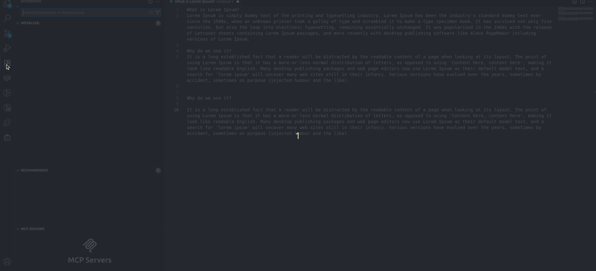

# Clip-Drop

*Demo: Clipboard History and Saved Snippets in action*

Clip-Drop is a Visual Studio Code extension designed to enhance your productivity by providing quick clipboard management and snippet insertion directly within the editor.

## Features

- **Clipboard History:** Automatically tracks up to 15 clipboard entries you copy during your session, including language and timestamp. Lets you quickly reuse recent clipboard items. Search and clear search supported.
- **Saved Snippets:** Save and manage your favorite snippets for long-term use. Search and clear search supported.
- Quickly insert saved or clipboard snippets into your code
- Simple and intuitive interface

## Installation

1. Download and install from the Visual Studio Marketplace (or package and install the .vsix file manually).
2. Reload or restart VS Code if required.

## Usage

- Use the command palette (`Ctrl+Shift+P` or `Cmd+Shift+P`) and search for 'Clip-Drop' commands.
- **Clipboard History:**
  - Every time you copy something, it is automatically added to the Clipboard History (up to 10 items, oldest removed first).
  - Use the search (magnifier) icon to filter clipboard entries by content or language.
  - Use the clear (close) icon to clear the search and show all clipboard entries.
  - Right-click an entry to copy or delete it, or clear all.
- **Saved Snippets:**
  - Save your current clipboard content as a snippet using the Paste button or command.
  - Use the search (magnifier) icon to filter saved snippets by content.
  - Use the clear (close) icon to clear the search and show all saved snippets.
  - Right-click an entry to copy or delete it, or clear all.

## Release Notes

### 0.0.2
- Initial release of Clip-Drop: basic clipboard and snippet management features.
- Added Clipboard History feature: automatic clipboard tracking, search, and clear search.

---

For feedback or issues, please open an issue on the project repository.
